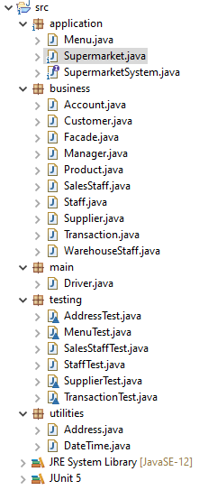
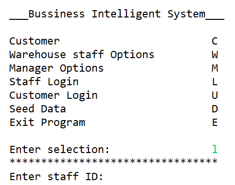
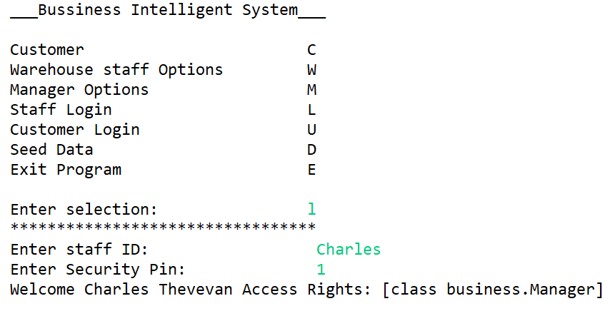
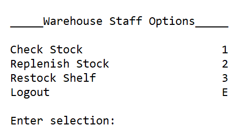
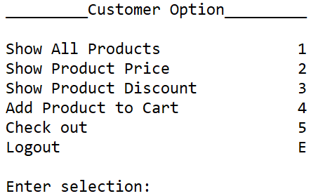

# SupermarketSystem
RMIT-SEF Semester 1 2019

© Kevin Vu 2019.
**Disclaimer:** This repo is an asset of Kevin Vu and is being developed as part of a School of Science Software Engineering Fundamentals course at RMIT University in Melbourne, Australia. Any **plagiarism** act will be reported.

## Team Member: 
- Shrey Parekh (Scrum Master)
- Kevin Vu (Tech Lead) 
- Juming Ha 
- Nicholas Oliver

## Project Brief:
Building of the Business Intelligence System has been an extensive **12 weeks** long process. Starting from **forming our groups**, creating **diagrams**, leading to our first milestone and up to the final day of completion our team has encountered with challenges along the way. 
- The first one of many was learning and implementing new diagrams to a personalized design was huge difficulty. 
- Along with **multi- tasking**, **time-management** and **prioritization** of this project, as a group, over other commitments was difficult. 
- There was a constant issue of language barrier as well.

We have completed quantifiably 95% of the code and have tried to design each diagram with utmost precision. This could have only been accomplished if all of us had worked together as a unit rather than individual members in disarray of each other. Upon this realization is where we started jumping over our problems and started coming up with solutions leading to us actually learning about software engineering and project management. 

## Functionalities
### Program Structure

### Menu

### Authentication

### Option Menu

## Project Outcomes
The question remains what are we taking away from this experience?  All of us have one common answer; we learnt how crucial **team work** and **team management** is to be successful in the industry. 
This project was a micro-organism of a reallife scenario and if this gave us challenges, we have been enabled to get insight into what we should expect put tenfold. 
We learnt how to effectively and clearly **demonstrate our ideas** to our team in order to have **productive meetings** and **utilize our time** to the maximum. 
From here we got the idea of **micro-planning** and working in a group full of different streams of knowledge, strengths as well as weaknesses. 
Making sure that the right mind was put to the right job and also shared equal load of other tasks was a significant lesson project management taught us. 
Having been able to apply software engineering theory to a practical opportunity has not made us complete software engineers yet, but it has helped us implant the correct initial footsteps. 

With the use of a **façade** that implements an interface, we are able to really confine the system to act according to how the client would want it. The application will not be able to run functions that are not existent in our application. 
Additionally, having a main supermarket class that holds all the functional methods of the software allows for easy code maintainability considering that we won’t have to search all our classes to remove an error or improve the code. We would just have open that one class and look for the method that addresses our issue. Adding to these benefits is that the supermarket class in a sense indirectly implements the interface as it contains all the methods in the interface. Meaning that the application is quite extensible in terms of adding a GUI to the application, considering that the supermarket class can work as our model in MVC approach.
